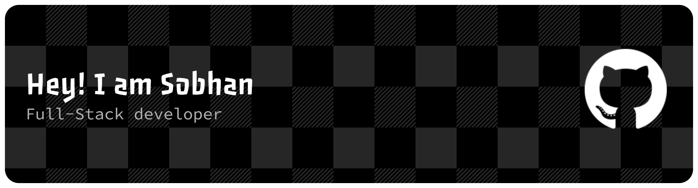
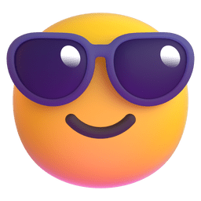
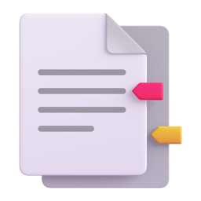

# Hey  What's up?

My name is **Sobhan** and I'm a Full-Stack Developer from Iran 

## About Me

 Full-Stack Developer based in Iran

 Working with PHP, JavaScript, and various frameworks

 Constantly learning and improving

 

## My Skills

